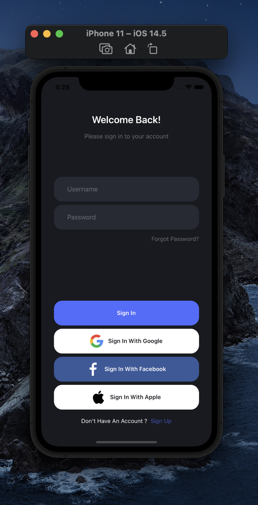
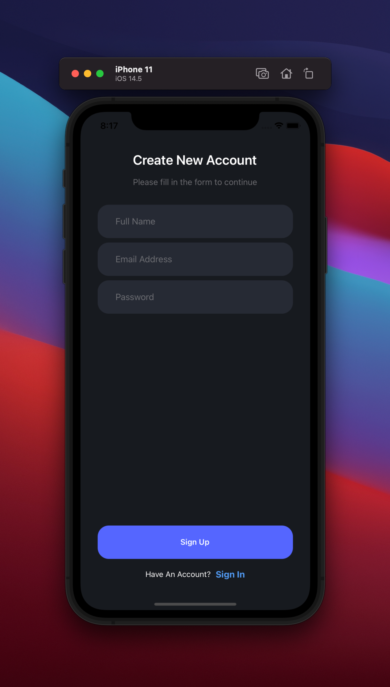

[](https://github.com/sevvaleygul0/react-native-dark-login-screen)

<table>
  <tr>
    <td align="center">
      
    </td>
    <td align="center">
      
    </td>
   </tr>
</table>

<table>
  <tr>
    <td align="center">
      
    </td>
   
   </tr>
</table>

# Installation

Add the dependency:

```bash
npm i react-native-dark-login-screen
```

## Peer Dependencies

<h5><i>IMPORTANT! You need install them</i></h5>

```js
"react": ">= 16.x.x",
"react-native": ">= 0.55.x",
```

# Usage

## Import

```jsx
import DarkLoginScreen from "react-native-dark-login-screen";
```

## Fundamental Usage

```jsx
<DarkLoginScreen
  handleSignInButton={() => {}}
  handleGoogleLogIn={() => {}}
  handleFacebookLogIn={() => {}}
  handleSignInButton={() => {}}
/>
```

# Configuration - Props

## Sign In Screen

| Property                |   Type    |            Default             | Description                                                                              |
| ----------------------- | :-------: | :----------------------------: | ---------------------------------------------------------------------------------------- |
| titleText               |  string   |         Welcome Back!          | change the title text                                                                    |
| titleTextStyle          | TextStyle |            default             | set or override the style object for the title text                                      |
| descriptionText         |  string   | Please sign in to your account | change the description text                                                              |
| descriptionTextStyle    | TextStyle |            default             | set or override the style object for the description                                     |
| usernamePlaceholder     |  string   |            Username            | change the username placeholder                                                          |
| textInputStyle          | ViewStyle |            default             | set or override the style object for the username, password, fullname, email text inputs |
| placeholderTextColor    |  string   |            #6C6D72             | change the placeholder text                                                              |
| passwordPlaceholder     |  string   |            Password            | change the password placeholder                                                          |
| passwordTextInputStyle  | ViewStyle |            default             | set or override the style object for the password text input                             |
| forgotPasswordText      |  string   |        Forgot Password?        | change the forgot password text                                                          |
| forgotPasswordTextStyle | TextStyle |            default             | change the forgot button's text                                                          |
| signInButtonStyle       | ViewStyle |            default             | set or override the style object for the sign in button style                            |
| signInButtonText        |  string   |            Sign In             | change the sign in button text                                                           |
| signInButtonTextStyle   | TextStyle |            default             | set or override the style object for the sign in button text style                       |
| googleButtonStyle       |   View    |            default             | set or override the style object for the google button style                             |
| googleButtonTextStyle   | TextStyle |            default             | set or override the style object for the google button text style                        |
| googleButtonText        |  string   |      Sign In With Google       | change the google button style                                                           |
| facebookButtonStyle     | ViewStyle |            default             | set or override the style object for the facebook button style                           |
| facebookButtonTextStyle | TextStyle |            default             | set or override the style object for the facebook button text style                      |
| facebookButtonText      |  string   |     Sign In With Facebook      | change the facebook button text                                                          |
| enableGoogleLogin       |  boolean  |              true              | enable the google login button                                                           |
| enableFacebookLogin     |  boolean  |              true              | enable the facebook login button                                                         |
| signUpQuestionText      |  string   |    Don't Have An Account ?     | change the question to sign up screen                                                    |
| signUpButtonText        |  string   |            Sign Up             | change the sign up button text                                                           |
| signUpTextStyle         | TextStyle |            default             | change the sign up button style                                                          |
| signUpButtonTextStyle   | TextStyle |            default             | set or override the style object for the sign up button text style                       |
| usernameChangeText      | function  |           undefined            | handle the usernameChangeText function                                                   |
| passwordChangeText      | function  |           undefined            | handle the passwordChangeText function                                                   |
| handleSignInButton      | function  |           undefined            | handle Sign In button is pressed                                                         |
| handleGoogleLogIn       | function  |           undefined            | handle handleGoogleLogIn button is pressed                                               |
| handleFacebookLogIn     | function  |           undefined            | handle handleFacebookLogIn button is pressed                                             |
| handleForgotPassword    | function  |           undefined            | handle handleForgotPassword button is pressed                                            |
| handleSignUp            | function  |           undefined            | handle handleSignUp button is pressed for navigation to sign up screen                   |

## Sign Up Screen

| Property                   |   Type    |               Default               | Description                                                                              |
| -------------------------- | :-------: | :---------------------------------: | ---------------------------------------------------------------------------------------- |
| signUpTitle                |  string   |         Create New Account          | change the sign up screen title                                                          |
| signUpDescriptionText      |  string   | Please fill in the form to continue | change the sign up description                                                           |
| signUpTitleTextStyle       | TextStyle |               default               | change the title text style                                                              |
| signUpDescriptionTextStyle | TextStyle |               default               | change the description text style                                                        |
| fullNamePlaceholderText    |  string   |              Full Name              | change the full name text input placeholder                                              |
| placeholderTextColor       |  string   |               #6C6D72               | change the placeholder text color                                                        |
| textInputStyle             | ViewStyle |               default               | set or override the style object for the username, password, fullname, email text inputs |
| emailPlaceholderText       |  string   |            Email Address            | change the placeholder for email text input                                              |
| passwordPlaceholder        |  string   |              Password               | change the placeholder for password text input                                           |
| passwordTextInputStyle     | ViewStyle |               default               | set or override the style object for the password text input                             |
| signUpButtonText           |  string   |               Sign Up               | change the sign up button text                                                           |
| signUpButtonStyle          | ViewStyle |               default               | set or override the style object for the sign up button style                            |
| signUpButtonTextStyle      | TextStyle |               default               | set or override the style object for the sign up button text style                       |
| signInQuestionTextStyle    | TextStyle |               default               | set or override the style object for the sign in question text style                     |
| signInQuestionText         |  string   |          Have An Account?           | change the sign in question text                                                         |
| signInButtonTextStyle      | TextStyle |               default               | set or override the style object for the sign in button text style                       |
| signInButtonText           |  string   |               Sign In               | change the sign in button text                                                           |
| fullNameOnChange           | function  |              undefined              | handle fullNameOnChange input is changed                                                 |
| emailOnChange              | function  |              undefined              | handle emailOnChange input is changed                                                    |
| singUpPasswordChangeText   | function  |              undefined              | handle singUpPasswordChangeText is changed                                               |
| handleSignUpButton         | function  |              undefined              | handle handleSignUpButton is pressed                                                     |
| handleSignIn               | function  |              undefined              | handle handleSignIn is pressed                                                           |

## Future Plans

- [x] ~~LICENSE~~
- [ ] Light mode integration :)

# Change Log

Change log will be here !

## Author

Sevval Eygul, sevvalleygull@gmail.com

## License

React Native Typescript Library Starter is available under the MIT license. See the LICENSE file for more info.
